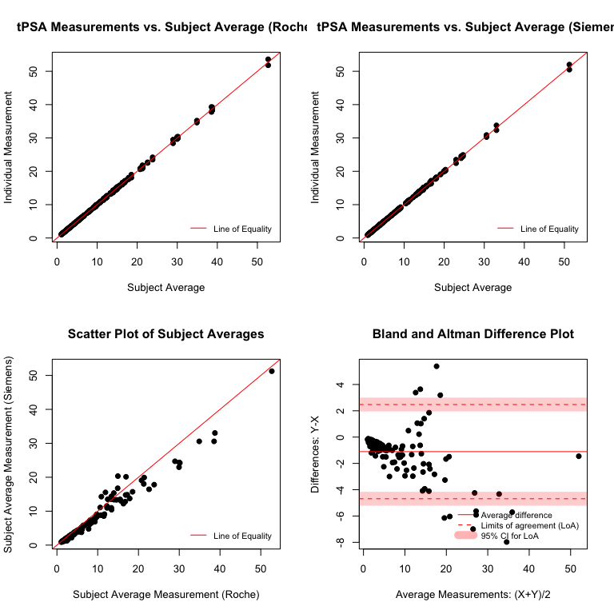
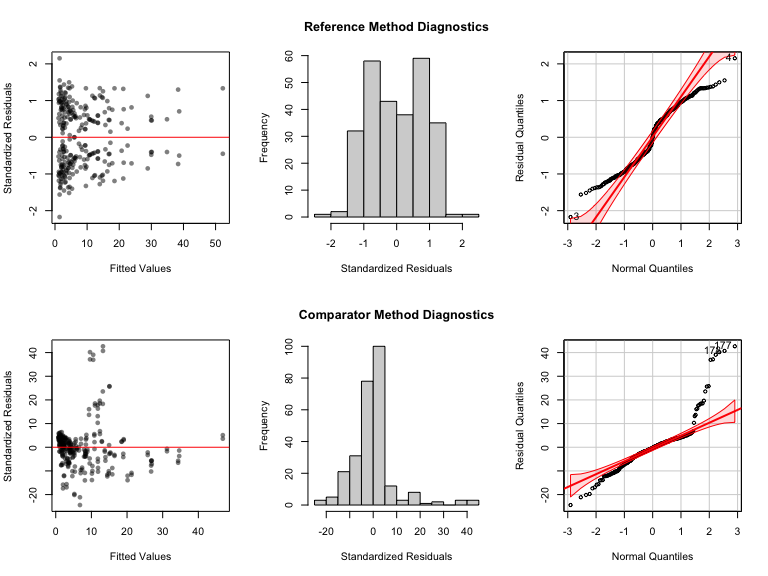
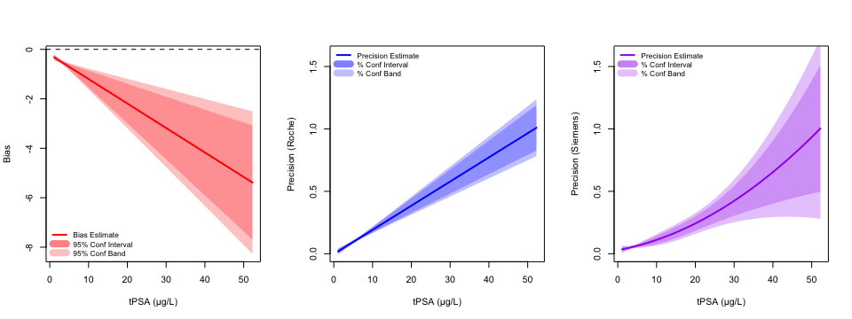
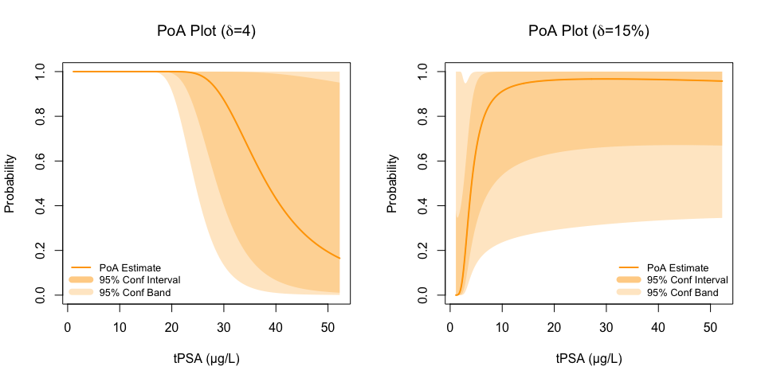
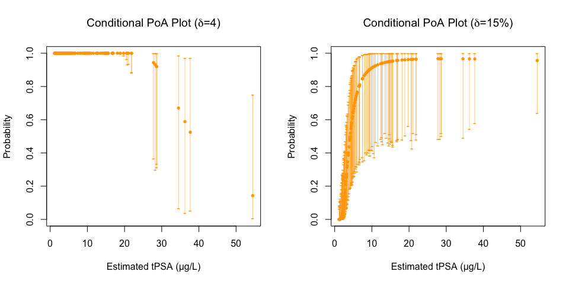
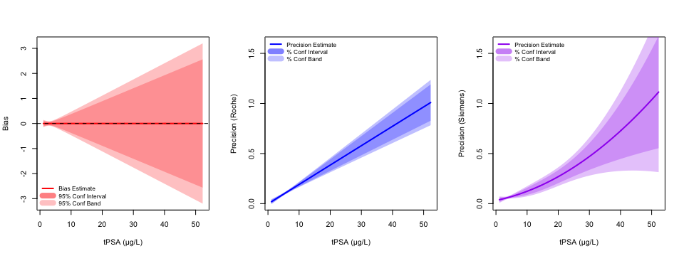
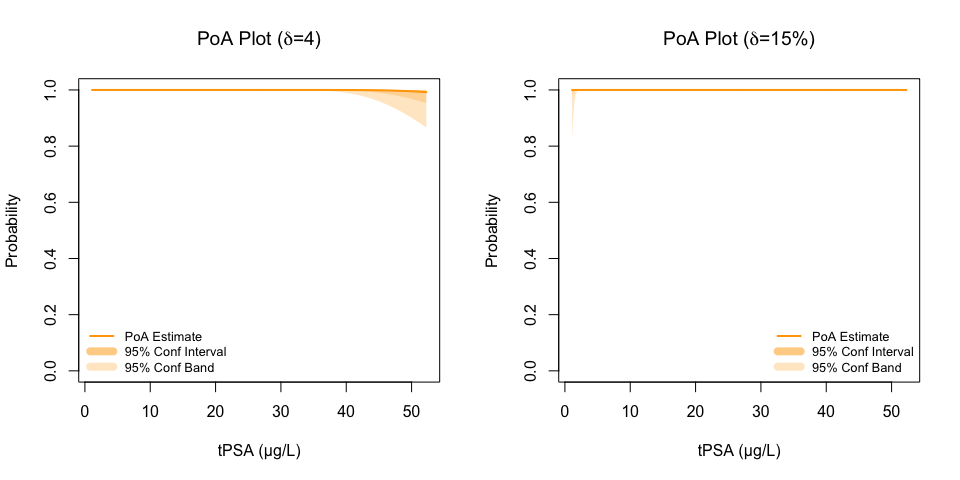

Vignette for tPSA Example
================

In this file we reproduce the results of the tPSA example presented in
Section 3 of the paper. This example concerns the comparison of methods
of measuring total Prostatic Specific Antigen (tPSA, μg/L) measurements
as first reported in [Ferraro et
al. (2023)](https://www.degruyterbrill.com/document/doi/10.1515/cclm-2022-0874/html).
The various analyses presented here make use of the functions provided
in the file `functions.R` and the data provided in the file
`tPSADataRvsS.csv`. We begin by loading those functions and loading that
data.

### Load the data and necessary functions

``` r
source(file = "functions.R")
svr <- read.csv(file = "tPSADataRvsS.csv", header = TRUE)
X <- svr$MS1
r_vec_x <- rep(2, 135)
Y <- svr$MS2
r_vec_y <- rep(2, 135)
```

### Visualize the data

Next we visualize the data through various scatterplots. The call below
to `data_visualization()` reproduces the plots provided in Figure 1 in
the paper.

``` r
data_vizualization(x = X, r_x = r_vec_x, y = Y, r_y = r_vec_y, s_name = "tPSA", ref_name = "Roche", com_name = "Siemens")
```



### Model fitting

We next fit the model described by Equation (2) in the paper. Note that
we do not specify the desired polynomial orders; instead we perform
order selection via the BIC-based selection method described in Section
2.1 of the paper. This is achieved with the `fit_model()` function and
the `order_select` input set to `TRUE`. Having done that, the values
passed into `orders` are taken to be the *largest* orders considered in
the BIC-based selection process. Alternatively, when
`order_select = FALSE`, the values passed into `orders` are the
polynomial orders $(p,d_x,d_y)$ used to fit the bias and precision
polynomials.

``` r
fitted_model <- fit_model(x = X, r_x = r_vec_x, y = Y, r_y = r_vec_y, orders = c(4,4,4), order_select = TRUE)
print(fitted_model)
```

    ## $Parameters
    ## [1] "mu"      "sigma"   "beta0"   "beta1"   "omegax0" "omegax1" "omegay0"
    ## [8] "omegay1" "omegay2"
    ## 
    ## $Estimates
    ## [1]  8.6413703704  8.8955882423 -0.2102838450  0.9009499941 -0.0021535235
    ## [6]  0.0193542807  0.0288392204  0.0057580464  0.0002468773
    ## 
    ## $BLA
    ##   [1]  4.395838  1.425276  2.120074  2.400197  3.060346  5.300827 21.260134
    ##   [8]  4.275167  2.480125  1.730140  1.210038 10.084759  5.670240  3.535273
    ##  [15]  3.305379  3.175292  2.035102  1.930136  1.335021  1.440146  2.795416
    ##  [22]  1.425057  1.990076  2.640190  7.770070  5.115188  5.695157  4.105632
    ##  [29]  3.150111  2.680121  9.624254  2.015103  4.555466  1.205059  1.435057
    ##  [36]  1.800138  2.545156  2.750030  4.535686  4.755207  9.769679  8.100011
    ##  [43]  1.610142  3.600229  5.515436  4.220201  2.110132  9.484744  2.020075
    ##  [50]  4.095243  2.295050  1.380009  1.110038  1.835054  4.525157  9.034945
    ##  [57]  2.210033  6.760342  4.745208  3.510233  2.385002 11.647626  9.304847
    ##  [64]  1.335058  7.995128  9.669936  6.055184  1.100010  2.740030  5.405295
    ##  [71]  2.495017 11.499639  6.565111  6.065138  1.660009 10.599753 10.899715
    ##  [78] 12.247152 12.446994 13.348662 11.899588 14.593231 13.299411 16.291299
    ##  [85] 13.941795 13.993912 17.842733 14.892890 14.940249 16.947638 18.524708
    ##  [92] 20.746558 21.385505 23.826493 28.872661 34.870169 38.338897 38.673148
    ##  [99] 52.253580  3.040255 16.843522 29.933183 10.799727  6.185131  4.585001
    ## [106] 29.975735  6.030000  2.300008  2.585017  3.075016  7.455009 15.699108
    ## [113]  3.545040  4.145240  2.990064  4.390344  2.220073  4.865097  8.445008
    ## [120]  6.440136 15.496535  4.885096  3.840097  1.630142  2.810118 30.133025
    ## [127]  2.420008  9.379985  9.429984 22.598236 17.249728 16.747695 13.399399
    ## [134] 13.348662 12.299538
    ## 
    ## $Bias_BIC
    ## [1] 216.8211 223.7870 331.1356 219.9857
    ## 
    ## $Prec_x_BIC
    ## [1] -426.9614 -610.1859 -608.2061 -606.1415 -596.4325
    ## 
    ## $Prec_y_BIC
    ## [1] -466.0027 -582.0324 -588.3644 -582.5929 -576.7901
    ## 
    ## $Optimal_orders
    ## [1] 1 1 2

### Extract parameter estimates and calculate CIs

Having fit the model and obtained parameter estimates, we next calculate
95% confidence intervals for the model parameters. We do so using the
*standard* bootstrap approach described in Section 2.4.1. This is
achieved by first using the `do_bootstrap()` function to take the
bootstrap samples, and then with the `calc_param_CIs()` function with
the `type` input set to `"standard"` to calculate the necessary
confidence limits. Alternatively, one could set `type = "percentile"` to
calculate the percentile-based bootstrap CIs described in Section 2.4.2.
The resulting table below is a reproduction of Table 1 from the paper.

``` r
library(doParallel, quietly = TRUE)
numCores <- detectCores()
registerDoParallel(numCores)
set.seed(123456789)
res_boot <- do_bootstrap(B = 10000, x = X, r_x = r_vec_x, y = Y, r_y = r_vec_y, orders = c(1,1,2))
CI <- calc_param_CIs(boot = res_boot, alpha = 0.05, theta_hat = fitted_model$Estimates, type = "standard")
parameters <- c("mu", "sigma", paste0("beta", 0:1), paste0("omegax", 0:1), paste0("omegay", 0:2))
results <- data.frame(Parameter = parameters, Estimates = fitted_model$Estimates, LB = CI$LB, UB = CI$UB)
kable(results)
```

| Parameter |  Estimates |         LB |         UB |
|:----------|-----------:|-----------:|-----------:|
| mu        |  8.6413704 |  7.1491457 | 10.1335950 |
| sigma     |  8.8955882 |  6.8875971 | 10.9035794 |
| beta0     | -0.2102838 | -0.3588362 | -0.0617315 |
| beta1     |  0.9009500 |  0.8542622 |  0.9476378 |
| omegax0   | -0.0021535 | -0.0254093 |  0.0211022 |
| omegax1   |  0.0193543 |  0.0154851 |  0.0232235 |
| omegay0   |  0.0288392 | -0.0002323 |  0.0579107 |
| omegay1   |  0.0057580 | -0.0027711 |  0.0142872 |
| omegay2   |  0.0002469 | -0.0000662 |  0.0005599 |

### Visualize model diagnostics

As demonstrated below, the function `model_diagnostics()` may be used to
construct scatterplots, histograms, and QQ-plots which facilitate
informal evaluation of the appropriateness of the model for each method.
Note that the plots below were not included in the main text of the
paper.

``` r
library(car, quietly = TRUE)
model_diagnostics(x = X, r_x = r_vec_x, y = Y, r_y = r_vec_y, fitted_model = fitted_model, orders = c(1,1,2))
```



### Visualize method comparison

Having fit the model, we can now calculate and visualize various
agreement metrics that quantify the comparability of the methods under
comparison. With the `calculate_bias()` and `calculate_precision()`
functions, we produce plots of the estimated bias and precision
polynomials $g(s;\hat{\boldsymbol{\beta}})$,
$\sigma_x(s;\hat{\boldsymbol{\omega}}_x)$,
$\sigma_y(s;\hat{\boldsymbol{\omega}}_y)$ described in Section 2.1. The
plots below are a reproduction of Figure 2 in the paper.

``` r
par(mfrow=c(1,3))
bias <- calculate_bias(theta = fitted_model$Estimates, orders = c(1,1,2), 
                       s = seq(from = min(fitted_model$BLA), to = max(fitted_model$BLA), length.out = 500),
                       interval_info = list(type = "standard", boot = res_boot, alpha = 0.05), 
                       plot_info = list(leg_location = "bottomleft", colour = "red", s_name = "tPSA (μg/L)"))
precision_x <- calculate_precision(theta = fitted_model$Estimates, orders = c(1,1,2), method = "R", 
                       s = seq(from = min(fitted_model$BLA), to = max(fitted_model$BLA), length.out = 500),
                       interval_info = list(type = "standard", boot = res_boot, alpha = 0.05), 
                       plot_info = list(leg_location = "topleft", colour = "blue", s_name = "tPSA (μg/L)", 
                                        method_name = "Roche", ylimits = c(0, 1.6)))
precision_y <- calculate_precision(theta = fitted_model$Estimates, orders = c(1,1,2), method = "C", 
                       s = seq(from = min(fitted_model$BLA), to = max(fitted_model$BLA), length.out = 500),
                       interval_info = list(type = "standard", boot = res_boot, alpha = 0.05), 
                       plot_info = list(leg_location = "topleft", colour = "purple", s_name = "tPSA (μg/L)", 
                                        method_name = "Siemens", ylimits = c(0, 1.6)))
```



We next calculate and visualize the probability of agreement function
using the `calculate_poa()` function. Note that the `delta` input
controls the specification of the equivalence margin. When an
indifference region with a fixed equivalence margin is desired, e.g.,
`[-x,x]`, one should input a scalar such as `delta = x`. Alternatively,
if an indifference region with a relative equivalence margin is desired,
e.g., 15%, one should input a string such as `delta = "x%"`. The plots
below reproduce the left column of plots in Figure 2 in the paper.

``` r
s <- seq(from = min(fitted_model$BLA), to = max(fitted_model$BLA), length.out = 500)
par(mfrow = c(1,2))
# Fixed delta
poa_fix <- calculate_poa(theta = fitted_model$Estimates, delta = 4, orders = c(1,1,2), s = s,
                       interval_info = list(type = "standard", boot = res_boot, alpha = 0.05), 
                       plot_info = list(leg_location = "bottomleft", colour = "orange", s_name = "tPSA (μg/L)"))
title(main = bquote("PoA Plot ("*delta*"=4)"))
# Relative delta
poa_rel <- calculate_poa(theta = fitted_model$Estimates, delta = "15%", orders = c(1,1,2), s = s,
                       interval_info = list(type = "standard", boot = res_boot, alpha = 0.05), 
                       plot_info = list(leg_location = "bottomright", colour = "orange", s_name = "tPSA (μg/L)"))
title(main = bquote("PoA Plot ("*delta*"=15%)"))
```



Note that the bias, precision, and PoA plots presented above were
constructed with `"standard"` bootstrap confidence intervals/bands. One
could instead set `type = "percentile"` in the respective calls to
`calculate_bias()`, `calculate_precision()`, and `calculate_poa()` to
construct percentile-based bootstrap confidence intervals/bands. Doing
so would recreate Figure A1 from the Appendix.

As discussed in Section 2.5, one may wish to work with the *conditional*
probability of agreement, which calculates the PoA for the individual
subjects in the study. The `conditional_poa()` may be used for this
purpose. Note that the `delta` input works the same way in this function
as in `calculate_poa()`. The plots below reproduce the right column of
plots in Figure 2 in the paper.

``` r
par(mfrow = c(1,2))
# Fixed delta
numCores <- detectCores()
registerDoParallel(numCores)
set.seed(123456789)
cond_poa <- conditional_poa(x = X, r_x = r_vec_y, y = Y, r_y = r_vec_y, orders = c(1,1,2), 
                            delta = 4, B = 1000, alpha = 0.05,
                            plot_info = list(colour = "orange", s_name = "Estimated tPSA (μg/L)"))
title(main = bquote("Conditional PoA Plot ("*delta*"=4)"))
# Relative delta
cond_poa <- conditional_poa(x = X, r_x = r_vec_y, y = Y, r_y = r_vec_y, orders = c(1,1,2), 
                            delta = "15%", B = 1000, alpha = 0.05,
                            plot_info = list(colour = "orange", s_name = "Estimated tPSA (μg/L)"))
title(main = bquote("Conditional PoA Plot ("*delta*"=15%)"))
```



### Calibrated analysis

As presented in Section 3, one may wish to calibrate (bias correct) the
measurements by the comparator method and then quantify agreement
*after* calibration. We illustrate such an analysis here, beginning by
performing the calibration.

``` r
beta_hat <- fitted_model$Estimates[3:4]
Y_c <- (Y - beta_hat[1]) / beta_hat[2]
fitted_model_c <- fit_model(x = X, r_x = r_vec_x, y = Y_c, r_y = r_vec_y, orders = c(1,1,2), order_select = FALSE)
library(doParallel, quietly = TRUE)
numCores <- detectCores()
registerDoParallel(numCores)
set.seed(123456789)
res_boot_c <- do_bootstrap(B = 10000, x = X, r_x = r_vec_x, y = Y_c, r_y = r_vec_y, orders = c(1,1,2))
```

Having calibrated the comparator measurements, refit the model with
them, and rerun the bootstrap with them, we construct the bias and
precision plots after calibration, by again calling `calculate_bias()`
and `calculate_precision()`. Note that the plots below were not included
in the main text of the paper.

``` r
par(mfrow=c(1,3))
bias <- calculate_bias(theta = fitted_model_c$Estimates, orders = c(1,1,2), 
                       s = seq(from = min(fitted_model_c$BLA), to = max(fitted_model_c$BLA), length.out = 500),
                       interval_info = list(type = "standard", boot = res_boot_c, alpha = 0.05), 
                       plot_info = list(leg_location = "bottomleft", colour = "red", s_name = "tPSA (μg/L)"))
precision_x <- calculate_precision(theta = fitted_model_c$Estimates, orders = c(1,1,2), method = "R", 
                       s = seq(from = min(fitted_model_c$BLA), to = max(fitted_model_c$BLA), length.out = 500),
                       interval_info = list(type = "standard", boot = res_boot_c, alpha = 0.05), 
                       plot_info = list(leg_location = "topleft", colour = "blue", s_name = "tPSA (μg/L)", 
                                        method_name = "Roche", ylimits = c(0, 1.6)))
precision_y <- calculate_precision(theta = fitted_model_c$Estimates, orders = c(1,1,2), method = "C", 
                       s = seq(from = min(fitted_model_c$BLA), to = max(fitted_model_c$BLA), length.out = 500),
                       interval_info = list(type = "standard", boot = res_boot_c, alpha = 0.05), 
                       plot_info = list(leg_location = "topleft", colour = "purple", s_name = "tPSA (μg/L)", 
                                        method_name = "Siemens", ylimits = c(0, 1.6)))
```



We similarly constructed PoA plots after calibration by calling
`calculate_poa()` with the calibrated model and bootstrap. The plots
below reproduce Figure 4 in the paper.

``` r
s <- seq(from = min(fitted_model_c$BLA), to = max(fitted_model_c$BLA), length.out = 500)
par(mfrow = c(1,2))
# Fixed delta
poa_fix <- calculate_poa(theta = fitted_model_c$Estimates, delta = 4, orders = c(1,1,2), s = s,
                       interval_info = list(type = "standard", boot = res_boot_c, alpha = 0.05), 
                       plot_info = list(leg_location = "bottomleft", colour = "orange", s_name = "tPSA (μg/L)"))
title(main = bquote("PoA Plot ("*delta*"=4)"))
# Relative delta
poa_rel <- calculate_poa(theta = fitted_model_c$Estimates, delta = "15%", orders = c(1,1,2), s = s,
                       interval_info = list(type = "standard", boot = res_boot_c, alpha = 0.05), 
                       plot_info = list(leg_location = "bottomright", colour = "orange", s_name = "tPSA (μg/L)"))
title(main = bquote("PoA Plot ("*delta*"=15%)"))
```


